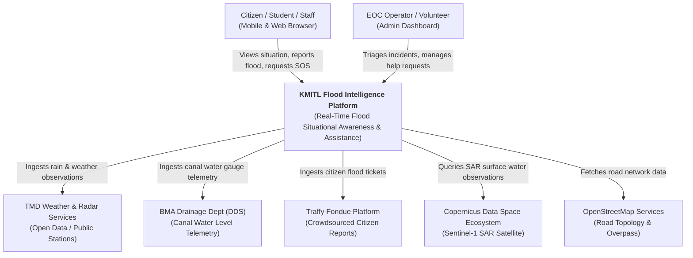
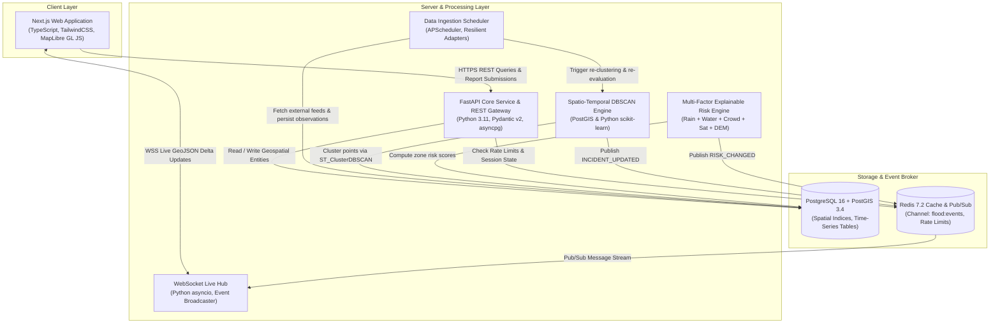
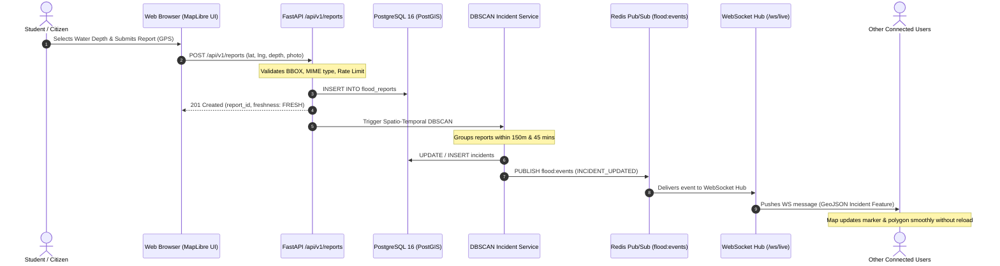
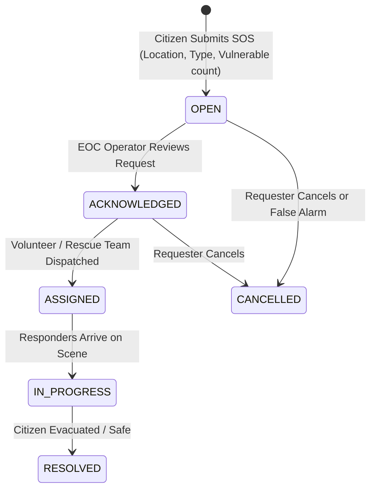

# System Architecture & Technical Design
## KMITL FLOOD INTELLIGENCE

เอกสารนี้อธิบายสถาปัตยกรรมระบบโดยละเอียดของ **KMITL Flood Intelligence Platform** ตามหลักการ C4 Model และ Event-Driven Geospatial Architecture.

---

## 1. System Context Diagram (C4 Level 1)

---

## 2. Container Diagram (C4 Level 2)

---

## 3. End-to-End Event Flow (Crowd Report to Live Map)

---

## 4. Emergency Assistance (SOS) Workflow

